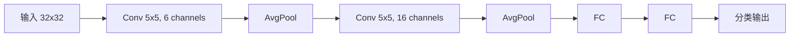
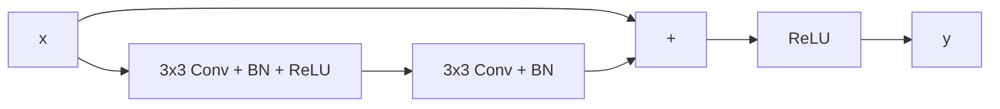

# CNN 卷积神经网络与池化

## 学习法小结

这一章把 CNN 看成“图像特征提取器”来学，会比直接背网络结构更容易。

学习顺序：

1. 先理解图像张量 `H x W x C` 和 PyTorch 里的 `N x C x H x W`。
2. 再手算一次卷积核滑动求和。
3. 然后理解 stride、padding、通道数如何影响输出尺寸和参数量。
4. 最后看池化、感受野、LeNet、VGG、ResNet。

最小掌握目标：

- 能解释卷积核为什么能检测边缘、纹理等局部特征。
- 能计算简单卷积层的输出尺寸。
- 能说明池化的作用和信息损失。

自测问题：

- 卷积层和全连接层相比，参数为什么少？
- padding 增大时，输出尺寸会如何变化？
- ResNet 的残差连接主要解决什么问题？

## 0. 这章到底要学什么

这一章不是只背“卷积、池化、LeNet、ResNet”这些名字，而是要把 CNN 的主线串起来：

$$
\text{图像} \rightarrow \text{卷积提特征} \rightarrow \text{非线性} \rightarrow \text{下采样} \rightarrow \text{分类或检测}
$$

学完这一章，你至少应该能回答：

- 卷积核到底怎么在图像上计算。
- 卷积核为什么能提取边缘、纹理、形状。
- stride、padding 如何影响输出尺寸。
- 池化到底在干什么，为什么会损失信息。
- LeNet 为什么是 CNN 入门结构。
- ResNet 为什么能训练很深的网络。
- 论文里看到 `backbone=ResNet-50` 时大概是什么意思。

建议学习顺序：

1. 先看图像张量和卷积核计算。
2. 再看 stride、padding、输出尺寸公式。
3. 再看池化、感受野、卷积块。
4. 最后看 LeNet、VGG、ResNet 这些经典结构。

## 1. CNN 是什么

CNN 全称 Convolutional Neural Network，中文叫卷积神经网络。

它特别适合处理具有空间结构的数据：

- 图像分类。
- 目标检测。
- 语义分割。
- 医学影像分析。
- 遥感图像识别。
- 视频帧特征提取。

CNN 的核心思想是：

$$
\text{用小卷积核在图像上滑动，提取局部特征，再逐层组合成高级语义}
$$

例子：
在人脸识别里，浅层卷积可能学到边缘、颜色变化；中层卷积可能学到眼睛、鼻子、嘴巴；深层卷积可能学到整张脸的结构。

## 2. 图像在模型里长什么样

彩色图像通常是三维张量：

$$
H \times W \times C
$$

其中：

- `H` 是高度。
- `W` 是宽度。
- `C` 是通道数。

例如一张常见 RGB 图像：

$$
224 \times 224 \times 3
$$

在 PyTorch 里，batch 输入通常写成：

$$
N \times C \times H \times W
$$

其中 `N` 是 batch size。

例子：
如果一次喂给模型 32 张 RGB 图片，每张大小是 `224x224`，输入张量形状通常是：

$$
32 \times 3 \times 224 \times 224
$$

## 3. 为什么图像适合 CNN

图像有三个特点：

- 局部相关性：相邻像素关系强。
- 空间结构：上下左右位置有意义。
- 平移相似性：同一个物体出现在不同位置，本质仍然是同一类。

CNN 正好利用这三个特点：

- 局部连接：每个卷积核只看局部区域。
- 权重共享：同一个卷积核在整张图上反复使用。
- 层级特征：浅层学边缘，深层学语义。

和全连接层相比，卷积层参数更少。

如果输入图像是 `224x224x3`，直接连到 1000 个神经元，全连接参数量约为：

$$
224 \times 224 \times 3 \times 1000
$$

而一个 `3x3` 卷积核只需要：

$$
3 \times 3 \times 3 = 27
$$

这就是 CNN 比普通 MLP 更适合图像的核心原因之一。

## 4. 卷积核是什么

卷积核也叫 filter 或 kernel。它是一个小矩阵，会在图像上滑动。

例如一个 `3x3` 卷积核：

$$
K =
\begin{bmatrix}
1 & 0 & -1 \\
1 & 0 & -1 \\
1 & 0 & -1
\end{bmatrix}
$$

这个卷积核对垂直边缘敏感，因为它会比较左侧和右侧像素的差异。

实际 CNN 中，卷积核不是人工写死的，而是通过训练学出来的。

## 5. 卷积到底怎么算

严格数学里的卷积会翻转卷积核，但深度学习框架里常用的是互相关 cross-correlation，只是习惯上也叫 convolution。

对单通道图像，一个位置的卷积输出可以写成：

$$
Y_{i,j} = b + \sum_{u=0}^{K_h-1}\sum_{v=0}^{K_w-1} W_{u,v} X_{i+u,j+v}
$$

其中：

- `X` 是输入图像或特征图。
- `W` 是卷积核参数。
- `b` 是偏置。
- `K_h, K_w` 是卷积核高度和宽度。
- `Y_{i,j}` 是输出特征图第 `(i, j)` 个位置。

多通道输入时，需要对所有输入通道一起求和：

$$
Y_{i,j,c_{\text{out}}}
= b_{c_{\text{out}}}
+ \sum_{c=1}^{C_{\text{in}}}
\sum_{u=0}^{K_h-1}
\sum_{v=0}^{K_w-1}
W_{u,v,c,c_{\text{out}}}X_{i+u,j+v,c}
$$

这条公式的意思很直接：

$$
\text{局部区域里的像素} \times \text{卷积核权重} \rightarrow \text{求和得到一个新特征}
$$

### 5.1 手算一个卷积例子

输入局部区域：

$$
X =
\begin{bmatrix}
1 & 2 & 0 \\
0 & 1 & 3 \\
2 & 1 & 0
\end{bmatrix}
$$

卷积核：

$$
K =
\begin{bmatrix}
1 & 0 & -1 \\
1 & 0 & -1 \\
1 & 0 & -1
\end{bmatrix}
$$

计算：

$$
Y = 1\times1 + 2\times0 + 0\times(-1)
+ 0\times1 + 1\times0 + 3\times(-1)
+ 2\times1 + 1\times0 + 0\times(-1)
$$

$$
Y = 1 - 3 + 2 = 0
$$

这只是输出特征图里的一个位置。卷积核继续滑动，就会得到整张输出特征图。

## 6. 输出通道数和参数量

一个卷积核会产生一个输出通道。

如果有 `C_out` 个卷积核，输出就有 `C_out` 个通道。

卷积层参数量是：

$$
\text{参数量} = K_h \times K_w \times C_{\text{in}} \times C_{\text{out}} + C_{\text{out}}
$$

最后的 `C_out` 是 bias。

例子：
输入通道是 3，卷积核大小是 `3x3`，输出通道是 64，那么参数量是：

$$
3 \times 3 \times 3 \times 64 + 64 = 1792
$$

这比全连接层少很多。

## 7. stride、padding 和输出尺寸

### 7.1 stride

stride 是卷积核每次滑动的步长。

$$
S=1 \Rightarrow \text{每次移动 1 个像素}
$$

$$
S=2 \Rightarrow \text{每次移动 2 个像素}
$$

stride 越大：

- 输出尺寸越小。
- 计算量越低。
- 信息损失越多。

### 7.2 padding

padding 是在图像边缘补值。

常见设置：

- valid padding：不补边，输出尺寸变小。
- same padding：补边，让输出尺寸尽量保持不变。

例如 `3x3` 卷积常用：

$$
P=1
$$

`5x5` 卷积常用：

$$
P=2
$$

### 7.3 输出尺寸公式

对于输入尺寸 `W`，卷积核大小 `F`，padding `P`，stride `S`：

$$
W_{\text{out}} =
\left\lfloor
\frac{W - F + 2P}{S}
\right\rfloor + 1
$$

如果高和宽不同，则分别计算：

$$
H_{\text{out}} =
\left\lfloor
\frac{H - K_h + 2P_h}{S_h}
\right\rfloor + 1
$$

$$
W_{\text{out}} =
\left\lfloor
\frac{W - K_w + 2P_w}{S_w}
\right\rfloor + 1
$$

例子：

$$
W=32,\quad F=3,\quad P=1,\quad S=1
$$

$$
W_{\text{out}} =
\left\lfloor
\frac{32 - 3 + 2 \times 1}{1}
\right\rfloor + 1
= 32
$$

所以 `3x3` 卷积加 `P=1` 可以保持尺寸不变。

## 8. 池化 Pooling

池化用于下采样，减少特征图尺寸和计算量。

常见池化：

- Max Pooling：取局部最大值。
- Average Pooling：取局部平均值。
- Global Average Pooling：每个通道整张图求平均。

### 8.1 最大池化

$$
2 \times 2\ \text{max pooling}
$$

$$
\begin{bmatrix}
1 & 3 \\
2 & 4
\end{bmatrix}
\Rightarrow 4
$$

最大池化保留最显著特征。

### 8.2 平均池化

$$
2 \times 2\ \text{average pooling}
$$

$$
\begin{bmatrix}
1 & 3 \\
2 & 4
\end{bmatrix}
\Rightarrow 2.5
$$

平均池化保留整体统计信息，更平滑。

### 8.3 全局平均池化

全局平均池化对每个通道的整个特征图求平均：

$$
7 \times 7 \times 512 \rightarrow 1 \times 1 \times 512
$$

它常用于替代全连接分类头，减少参数量和过拟合。

## 9. 感受野

感受野表示输出特征中一个位置能看到输入图像的多大区域。

一层 `3x3` 卷积只能看 `3x3` 的局部区域。

两层 `3x3` 卷积堆叠后，有效感受野接近 `5x5`。

三层 `3x3` 卷积堆叠后，有效感受野接近 `7x7`。

这也是 VGG 喜欢堆叠 `3x3` 卷积的重要原因：

- 参数更少。
- 非线性更多。
- 感受野逐层扩大。

## 10. 常见 CNN 基本块

实际 CNN 常见结构不是单独一个卷积，而是一个 block：

$$
\text{Conv} \rightarrow \text{BatchNorm} \rightarrow \text{ReLU}
$$

有时后面接池化或 stride convolution 做下采样：

$$
\text{Conv} \rightarrow \text{BN} \rightarrow \text{ReLU} \rightarrow \text{Pooling}
$$

每个部分的作用：

- Conv：提取局部特征。
- BatchNorm：稳定数值分布，加快训练。
- ReLU：加入非线性。
- Pooling 或 stride convolution：降低空间尺寸。

## 11. LeNet

LeNet 是早期 CNN 代表，主要用于手写数字识别。

它的意义是：证明“卷积 + 池化 + 全连接”可以有效处理图像。

典型结构：



可以粗略记成：

$$
\text{Conv} \rightarrow \text{Pool} \rightarrow \text{Conv} \rightarrow \text{Pool} \rightarrow \text{FC} \rightarrow \text{Output}
$$

为什么课程里常讲 LeNet：

- 它结构简单，适合理解 CNN 基本流程。
- 它展示了卷积和池化如何组合。
- 它是后来深层 CNN 的基础原型。

## 12. AlexNet、VGG、Inception

### 12.1 AlexNet

AlexNet 让深度学习在 ImageNet 图像分类中爆发。

关键点：

- 更深更宽的 CNN。
- 使用 ReLU。
- 使用 Dropout。
- 使用数据增强。
- 使用 GPU 训练。

你可以把 AlexNet 理解成：CNN 从“能用”走向“大规模图像任务有效”的标志。

### 12.2 VGG

VGG 的核心特点是大量堆叠 `3x3` 卷积。

结构很规整：

$$
\text{多个 } 3 \times 3 \text{ Conv} \rightarrow \text{Pool} \rightarrow \text{更多 } 3 \times 3 \text{ Conv}
$$

为什么不用一个大卷积核，而用多个 `3x3`：

- 两个 `3x3` 感受野接近 `5x5`。
- 三个 `3x3` 感受野接近 `7x7`。
- 参数更少。
- 中间可以插入更多 ReLU，表达能力更强。

缺点：

- 参数量大。
- 计算成本高。

### 12.3 Inception

Inception 的思想是同一层并行使用不同尺度卷积。

例如：

$$
1 \times 1,\quad 3 \times 3,\quad 5 \times 5,\quad \text{pooling}
$$

然后把不同分支结果在通道维度拼接。

作用：

- 同时捕捉不同尺度特征。
- 使用 `1x1` 卷积降维，减少计算量。

## 13. ResNet

ResNet 是 CNN 里非常重要的经典网络。它解决的问题是：网络变深后，训练反而变难，效果可能下降。

### 13.1 残差连接

ResNet 的核心是残差连接：

$$
y = F(x) + x
$$

其中：

- `x` 是输入。
- `F(x)` 是卷积分支学到的残差。
- `x` 是 shortcut 直接跳过去。
- `y` 是输出。

没有残差时，网络直接学习目标映射：

$$
H(x)
$$

有残差后，网络学习：

$$
F(x) = H(x) - x
$$

如果最优映射接近恒等映射，学习 `F(x)=0` 比直接学习复杂的 `H(x)` 更容易。

### 13.2 ResNet 基本块

ResNet-18、ResNet-34 常用 Basic Block：



公式：

$$
y = \mathrm{ReLU}(F(x) + x)
$$

### 13.3 Bottleneck Block

ResNet-50、ResNet-101 常用 Bottleneck Block：

$$
1 \times 1 \rightarrow 3 \times 3 \rightarrow 1 \times 1
$$

作用：

- 第一个 `1x1` 降维。
- 中间 `3x3` 提取空间特征。
- 最后 `1x1` 升维。

这样可以在网络很深时控制计算量。

### 13.4 维度不一致怎么办

如果输入 `x` 和 `F(x)` 的通道数或空间尺寸不同，不能直接相加，需要对 shortcut 做投影：

$$
y = F(x) + W_s x
$$

其中 `W_s` 通常用 `1x1` 卷积实现。

## 14. 经典 CNN 演化主线

| 网络 | 核心思想 | 你应该记住什么 |
| --- | --- | --- |
| LeNet | 卷积 + 池化 + 全连接 | CNN 入门原型 |
| AlexNet | 更深 CNN + ReLU + GPU | 深度 CNN 在 ImageNet 爆发 |
| VGG | 堆叠 `3x3` 卷积 | 结构清晰，参数较多 |
| Inception | 多尺度分支 | 同时看不同尺度 |
| ResNet | 残差连接 | 解决深层网络训练困难 |
| MobileNet | 深度可分离卷积 | 轻量化部署 |
| EfficientNet | 复合缩放 | 平衡精度和效率 |
| ConvNeXt | 现代化 CNN | 吸收 Transformer 训练经验 |

## 15. PyTorch 示例

下面是一个最小 CNN 分类模型：

```python
import torch.nn as nn


class SimpleCNN(nn.Module):
    def __init__(self, num_classes):
        super().__init__()
        self.features = nn.Sequential(
            nn.Conv2d(3, 32, kernel_size=3, padding=1),
            nn.BatchNorm2d(32),
            nn.ReLU(),
            nn.MaxPool2d(kernel_size=2, stride=2),
            nn.Conv2d(32, 64, kernel_size=3, padding=1),
            nn.BatchNorm2d(64),
            nn.ReLU(),
            nn.MaxPool2d(kernel_size=2, stride=2),
        )
        self.classifier = nn.Sequential(
            nn.AdaptiveAvgPool2d((1, 1)),
            nn.Flatten(),
            nn.Linear(64, num_classes),
        )

    def forward(self, x):
        x = self.features(x)
        x = self.classifier(x)
        return x
```

如果输入是 `224x224`，经过两次 `2x2` max pooling 后：

$$
224 \rightarrow 112 \rightarrow 56
$$

最后用全局平均池化把每个通道压成一个数，再接分类器。

## 16. 论文中如何写 CNN 或 Backbone

如果论文使用 CNN，不要只写“本文使用 CNN 提取特征”。至少要说明：

- 输入图像大小。
- 使用什么 backbone，例如 LeNet、ResNet-18、ResNet-50。
- 是否使用 ImageNet 预训练。
- 是否冻结 backbone。
- 提取哪一层特征。
- 输出特征如何接后续模块。

写法示例：

> 本文采用 ResNet-50 作为图像特征提取主干网络，并移除其原始分类头。输入图像经过多层卷积、批归一化、ReLU 激活和残差块后，得到高层语义特征。随后使用全局平均池化获得图像级表示，并将其输入后续分类模块。

如果要写公式，可以写：

$$
F = \mathrm{Backbone}(I)
$$

$$
z = \mathrm{GAP}(F)
$$

$$
\hat{y} = \mathrm{Classifier}(z)
$$

其中 `I` 是输入图像，`F` 是卷积特征图，`z` 是全局图像表示。

## 17. 常见问题

### 17.1 卷积核是不是人工设计的

传统图像处理里，边缘检测卷积核可以人工设计。

CNN 里卷积核参数通常是训练出来的。模型会根据任务自动学习哪些边缘、纹理或语义特征有用。

### 17.2 池化会不会损失信息

会。池化本质是下采样，一定会丢失部分细节。

但它可以减少计算量、扩大感受野，并保留主要响应。

### 17.3 为什么很多网络用 `3x3` 卷积

因为 `3x3` 卷积参数少、堆叠灵活，还能通过多层堆叠扩大感受野。

### 17.4 stride convolution 和 pooling 有什么区别

pooling 没有可学习参数，规则固定。

stride convolution 有可学习参数，可以学习如何下采样。

## 18. 这一章学完后你应该会什么

用下面问题检查自己：

1. 你能不能手算一个 `3x3` 卷积输出。
2. 你能不能用公式算卷积输出尺寸。
3. 你能不能解释一个卷积核为什么会产生一个输出通道。
4. 你能不能说明 LeNet 的基本结构。
5. 你能不能解释 ResNet 的 `F(x)+x` 为什么有用。
6. 你能不能说清楚论文里 `ResNet-50 backbone` 大概代表什么。

## 19. 记忆重点

- CNN 利用局部连接、权重共享和层级特征提取。
- 卷积核在局部区域做加权求和。
- 输出通道数等于卷积核个数。
- stride 控制步长，padding 控制边缘和输出尺寸。
- 输出尺寸公式是 `floor((W-F+2P)/S)+1`。
- 池化用于下采样，但会丢失部分信息。
- LeNet 是 CNN 入门原型。
- VGG 通过堆叠 `3x3` 卷积扩大感受野。
- ResNet 用残差连接 `y=F(x)+x` 解决深层网络训练困难。
