# Transformer 与注意力机制

## 0. 这章到底要学什么

Transformer 这章不是背几个英文模块名，而是要看懂一条完整的数据流：

$$
\text{token} \rightarrow \text{embedding} \rightarrow \text{position encoding} \rightarrow \text{attention} \rightarrow \text{FFN} \rightarrow \text{输出}
$$

学完这一章，你至少应该能回答：

- Transformer 论文里的 Encoder-Decoder 框架长什么样。
- Attention 为什么要有 `Q`、`K`、`V`。
- Scaled Dot-Product Attention 的公式每一项在做什么。
- Multi-Head Attention 为什么要分多个 head。
- Encoder、Decoder、Masked Self-Attention、Cross-Attention 有什么区别。
- BERT、GPT、ViT 分别用了 Transformer 的哪一部分。
- 写论文时怎么描述自己用了 Transformer。

这章建议按下面顺序学：

1. 先看论文框架图，知道整体结构。
2. 再看 Attention 公式，理解核心计算。
3. 再看 Encoder 和 Decoder 的区别。
4. 最后看 BERT、GPT、ViT 和论文写法。

## 1. Transformer 论文框架图

Transformer 来自论文《Attention Is All You Need》。论文中的核心结构是 Encoder-Decoder。先看原论文 Figure 1：

图源：Vaswani et al., *Attention Is All You Need*, Figure 1, arXiv:1706.03762。

这张图先看整体，不要一开始就抠每个箭头。你先抓住：

- 左边是 Encoder。
- 右边是 Decoder。
- Encoder 和 Decoder 都是堆叠 `N` 层。
- 每个大模块里面都有 Attention、Add & Norm、Feed Forward。
- Decoder 比 Encoder 多了 Masked Multi-Head Attention 和 Encoder-Decoder Attention。

下面是同一结构的可编辑 Mermaid 版本，方便你后面改论文笔记或画自己的模型结构。

```mermaid
flowchart LR
    src["源序列 tokens"] --> src_emb["Input Embedding"]
    src_emb --> src_pos["Positional Encoding"]

    subgraph encoder["Encoder x N"]
        enc_attn["Multi-Head Self-Attention"]
        enc_add1["Add + Norm"]
        enc_ffn["Feed Forward Network"]
        enc_add2["Add + Norm"]
        enc_attn --> enc_add1 --> enc_ffn --> enc_add2
    end

    src_pos --> enc_attn

    tgt["目标序列 tokens shifted right"] --> tgt_emb["Output Embedding"]
    tgt_emb --> tgt_pos["Positional Encoding"]

    subgraph decoder["Decoder x N"]
        dec_mask["Masked Multi-Head Self-Attention"]
        dec_add1["Add + Norm"]
        dec_cross["Multi-Head Cross-Attention"]
        dec_add2["Add + Norm"]
        dec_ffn["Feed Forward Network"]
        dec_add3["Add + Norm"]
        dec_mask --> dec_add1 --> dec_cross --> dec_add2 --> dec_ffn --> dec_add3
    end

    tgt_pos --> dec_mask
    enc_add2 --> dec_cross
    dec_add3 --> linear["Linear"]
    linear --> prob["Softmax"]
    prob --> out["预测下一个 token"]
```

你先记住三个大块：

- 左边是 Encoder，负责读懂输入。
- 右边是 Decoder，负责一步一步生成输出。
- Decoder 里有两种 attention：先看自己已经生成的内容，再看 Encoder 的输出。

例子：
机器翻译任务中，源序列是中文“我 喜欢 机器 学习”，目标序列是英文“I like machine learning”。Encoder 读中文句子，Decoder 根据已经生成的英文前缀继续预测下一个英文 token。

## 2. Transformer 解决什么问题

在 Transformer 之前，序列任务常用 RNN、LSTM、GRU。它们按时间顺序一步一步处理 token：

$$
x_1 \rightarrow x_2 \rightarrow x_3 \rightarrow \cdots \rightarrow x_n
$$

问题是：

- 长距离依赖不好学。
- 训练难以充分并行。
- 序列很长时信息容易衰减。

Transformer 的核心变化是：

$$
\text{每个 token 可以直接关注序列里的其他 token}
$$

这样模型不必一格一格传递信息，而是用 Attention 直接建立全局关系。

例子：
句子“这本书虽然很厚，但是内容很清楚，所以我推荐它”中，“它”指的是“这本书”。Self-Attention 可以让“它”直接关注到前面的“这本书”。

## 3. 输入如何进入 Transformer

原始文本不能直接进模型，必须先变成向量。

### 3.1 Token

Token 是模型处理文本的基本单位，可以是字、词、子词或 patch。

例子：

$$
\text{我喜欢机器学习} \rightarrow [\text{我}, \text{喜欢}, \text{机器}, \text{学习}]
$$

大模型里常见的是子词 token，例如英文单词 `learning` 可能被切成一个或多个 token。

### 3.2 Embedding

每个 token 会查表变成向量：

$$
x_i = \mathrm{Embedding}(t_i)
$$

其中 `t_i` 是第 `i` 个 token，`x_i` 是它对应的向量。

如果序列长度是 `n`，embedding 维度是 `d_model`，输入矩阵形状是：

$$
X \in \mathbb{R}^{n \times d_{\text{model}}}
$$

### 3.3 位置编码

Self-Attention 本身不关心顺序。也就是说，如果只看 Attention，模型不知道“我 喜欢 你”和“你 喜欢 我”的顺序差异。

所以要加入位置编码：

$$
Z = X + P
$$

其中 `X` 是 token embedding，`P` 是 positional encoding。

论文中使用的正弦余弦位置编码是：

$$
PE_{(pos, 2i)} = \sin\left(\frac{pos}{10000^{2i / d_{\text{model}}}}\right)
$$

$$
PE_{(pos, 2i+1)} = \cos\left(\frac{pos}{10000^{2i / d_{\text{model}}}}\right)
$$

你不需要一开始就背这个公式。先理解它的作用：给每个 token 加一个“我在第几个位置”的信息。

## 4. Attention 的直观理解

Attention 的核心思想是：

$$
\text{处理当前 token 时，动态关注其他相关 token}
$$

不是所有 token 都同等重要。Attention 会给不同 token 分配不同权重。

例子：
句子“苹果发布了新手机，它的屏幕更亮”。处理“它”时，模型应该更关注“苹果”和“新手机”，而不是“发布了”。

## 5. Query、Key、Value

Attention 里每个输入向量会变成三个向量：

- Query：当前 token 想找什么。
- Key：每个 token 能被别人匹配的特征。
- Value：真正要被加权汇总的信息。

矩阵形式是：

$$
Q = XW_Q
$$

$$
K = XW_K
$$

$$
V = XW_V
$$

其中：

- `X` 是输入序列表示。
- `W_Q, W_K, W_V` 是可学习参数矩阵。
- `Q, K, V` 是投影后的 Query、Key、Value。

一个粗略类比：

- Query 像搜索词。
- Key 像每条内容的索引标签。
- Value 像实际要读取的内容。

## 6. Scaled Dot-Product Attention

Transformer 的核心 attention 公式是：

$$
\mathrm{Attention}(Q, K, V)
= \mathrm{softmax}\left(\frac{QK^\top}{\sqrt{d_k}}\right)V
$$

这个公式可以拆成三步。

### 6.1 第一步：计算相似度

$$
S = QK^\top
$$

如果某个 Query 和某个 Key 很相似，点积就大，说明当前 token 应该更关注那个 token。

### 6.2 第二步：缩放

$$
\tilde{S} = \frac{S}{\sqrt{d_k}}
$$

为什么要除以 `sqrt(d_k)`：

- `d_k` 很大时，点积数值容易变大。
- 数值太大会让 softmax 过于极端。
- softmax 过于极端时，梯度会变小，训练不稳定。

### 6.3 第三步：softmax 得到权重

$$
A = \mathrm{softmax}(\tilde{S})
$$

`A` 是注意力权重矩阵，每一行表示一个 token 对其他 token 的关注程度。

### 6.4 第四步：加权汇总 Value

$$
O = AV
$$

最终输出 `O` 是对 Value 的加权求和。

一句话记忆：

$$
\text{用 } QK^\top \text{ 算关注谁，用 softmax 得到权重，再用权重汇总 } V
$$

## 7. Self-Attention

Self-Attention 指 `Q`、`K`、`V` 都来自同一个序列：

$$
Q = XW_Q,\quad K = XW_K,\quad V = XW_V
$$

它的作用是建模序列内部 token 之间的关系。

例子：
句子“我 喜欢 机器 学习”中，“学习”可以关注“机器”，因为“机器学习”是一个强相关短语；“我”也可以影响整句话的语义。

Self-Attention 的优点：

- 能直接建模长距离依赖。
- 可以并行计算。
- 不需要像 RNN 一样逐步递归。

代价是计算复杂度较高：

$$
O(n^2)
$$

其中 `n` 是序列长度。序列越长，注意力矩阵越大。

## 8. Multi-Head Attention

单个 attention 只能从一个表示空间里看关系。Multi-Head Attention 会并行做多组 attention。

第 `h` 个 head：

$$
\mathrm{head}_h =
\mathrm{Attention}(QW_h^Q, KW_h^K, VW_h^V)
$$

多个 head 拼接：

$$
\mathrm{MultiHead}(Q, K, V)
= \mathrm{Concat}(\mathrm{head}_1, \ldots, \mathrm{head}_H)W^O
$$

为什么要多头：

- 一个 head 可能关注局部邻近关系。
- 一个 head 可能关注主谓宾关系。
- 一个 head 可能关注指代关系。
- 多个 head 合起来表达能力更强。

例子：
翻译句子时，一个 head 可能关注当前词对应的源语言词，另一个 head 可能关注句法结构，还有一个 head 关注长距离指代。

## 9. Feed Forward Network

Transformer 每层里除了 attention，还有前馈网络 FFN。

论文中的形式是：

$$
\mathrm{FFN}(x) = \max(0, xW_1 + b_1)W_2 + b_2
$$

也可以写成：

$$
\mathrm{FFN}(x) = W_2 \mathrm{ReLU}(W_1x + b_1) + b_2
$$

Attention 负责让 token 之间交换信息，FFN 负责对每个 token 的表示做非线性变换。

## 10. Add & Norm

Transformer 每个子层后面通常都有残差连接和归一化：

$$
\mathrm{Output} = \mathrm{LayerNorm}(x + \mathrm{Sublayer}(x))
$$

其中：

- `x` 是子层输入。
- `Sublayer(x)` 可以是 attention 或 FFN。
- `x + Sublayer(x)` 是残差连接。
- `LayerNorm` 用于稳定训练。

作用：

- 残差连接让深层网络更容易训练。
- LayerNorm 让不同层的数值分布更稳定。

## 11. Transformer Encoder

Encoder 的一层结构是：

$$
\text{Input} \rightarrow \text{Multi-Head Self-Attention} \rightarrow \text{Add + Norm} \rightarrow \text{FFN} \rightarrow \text{Add + Norm}
$$

Encoder 做的事情是读懂输入序列，输出上下文表示：

$$
H = \mathrm{Encoder}(X)
$$

适合任务：

- 文本分类。
- 序列标注。
- 句子匹配。
- 表征学习。
- BERT 类模型。

例子：
情感分类中，Encoder 读完整句评论，输出一个融合上下文的表示，再接分类器判断正面或负面。

## 12. Transformer Decoder

Decoder 主要用于生成任务。它比 Encoder 多两个关键点：

- Masked Self-Attention。
- Cross-Attention。

### 12.1 Masked Self-Attention

生成第 `t` 个 token 时，不能偷看未来 token。

也就是说：

$$
P(y_t \mid y_1, y_2, \ldots, y_{t-1})
$$

不能依赖：

$$
y_{t+1}, y_{t+2}, \ldots
$$

所以需要 causal mask。

如果 `j > i`，第 `i` 个位置不能关注第 `j` 个位置：

$$
M_{ij} =
\begin{cases}
0, & j \le i \\
-\infty, & j > i
\end{cases}
$$

加 mask 后：

$$
\mathrm{Attention}(Q,K,V)
= \mathrm{softmax}\left(\frac{QK^\top + M}{\sqrt{d_k}}\right)V
$$

### 12.2 Cross-Attention

Cross-Attention 是 Decoder 关注 Encoder 输出。

在 Encoder-Decoder 结构里：

$$
Q = \text{Decoder hidden states}
$$

$$
K,V = \text{Encoder outputs}
$$

作用是让生成过程参考输入序列。

例子：
机器翻译生成英文单词时，Decoder 通过 Cross-Attention 去看中文源句里哪些词最相关。

## 13. Encoder-Decoder 用于什么任务

Encoder-Decoder Transformer 适合序列到序列任务：

$$
\text{输入序列} \rightarrow \text{输出序列}
$$

典型任务：

- 机器翻译。
- 摘要生成。
- 语音识别。
- 文本纠错。

训练时常用 teacher forcing：把真实目标序列右移一位作为 Decoder 输入。

$$
[y_1, y_2, \ldots, y_{T-1}] \rightarrow [y_2, y_3, \ldots, y_T]
$$

训练目标通常是最大化目标序列概率，或者最小化交叉熵：

$$
\mathcal{L}
= -\sum_{t=1}^{T} \log P(y_t \mid y_{<t}, X)
$$

## 14. BERT、GPT、T5 分别是什么

### 14.1 BERT：Encoder-only

BERT 只使用 Transformer Encoder。

特点：

- 双向上下文建模。
- 适合理解任务。
- 常用于分类、匹配、实体识别。

核心预训练任务之一是 Masked Language Modeling：

$$
P(x_{\mathrm{mask}} \mid x_{\mathrm{context}})
$$

### 14.2 GPT：Decoder-only

GPT 只使用 Transformer Decoder 的自回归部分。

特点：

- 从左到右预测下一个 token。
- 适合文本生成。
- 当前大语言模型主要是这一类。

训练目标：

$$
\mathcal{L}
= -\sum_{t=1}^{T} \log P(x_t \mid x_{<t})
$$

### 14.3 T5：Encoder-Decoder

T5 使用完整 Encoder-Decoder 结构。

特点：

- 把很多任务统一成 text-to-text。
- 输入是文本，输出也是文本。
- 适合翻译、摘要、问答等任务。

## 15. Vision Transformer

Vision Transformer（ViT）把图像切成 patch，再把 patch 当成 token。

流程：

1. 图像切成固定大小 patch。
2. 每个 patch 展平并映射成向量。
3. 加入位置编码。
4. 输入 Transformer Encoder。
5. 使用 `[CLS]` token 或平均池化做分类。

如果图像大小是 `H x W`，patch 大小是 `P x P`，patch 数量是：

$$
N = \frac{H W}{P^2}
$$

例子：
一张 `224x224` 图像，如果 patch 大小是 `16x16`：

$$
N = \frac{224 \times 224}{16^2} = 196
$$

这张图会被变成 196 个 patch token。

优点：

- 能建模全局关系。
- 大数据预训练下效果强。
- 架构统一，容易和文本、多模态模型结合。

缺点：

- 对数据量要求较高。
- 小数据上通常不如 CNN 稳。
- 注意力计算成本随 token 数平方增长。

## 16. Transformer 优缺点

优点：

- 能捕捉长距离依赖。
- 并行计算能力强。
- 可扩展性好。
- 适用于文本、图像、语音、多模态。

缺点：

- 标准 attention 复杂度是 `O(n^2)`。
- 需要较多数据和计算资源。
- 对位置编码和训练设置较敏感。
- 可解释性仍有限。

## 17. Attention 和 CNN 对比

| 项目 | CNN | Transformer |
| --- | --- | --- |
| 关注范围 | 局部感受野逐渐扩大 | 可直接建模全局关系 |
| 归纳偏置 | 强，适合图像局部结构 | 弱，更依赖数据 |
| 并行能力 | 强 | 强 |
| 数据需求 | 相对较低 | 通常较高 |
| 常见任务 | 图像、局部模式识别 | 文本、多模态、图像、长距离依赖 |

怎么理解：

- CNN 更像先看局部，再逐层扩大视野。
- Transformer 一开始就能让任意 token 互相看见。

## 18. 论文中如何写 Transformer

如果论文里使用 Transformer，不能只写“本文使用 Transformer 提取特征”。至少要交代下面内容：

- 输入如何变成 token。
- embedding 维度是多少。
- 是否加入位置编码，使用哪种位置编码。
- 使用 Encoder、Decoder 还是 Encoder-Decoder。
- Transformer 层数、head 数、hidden dimension、FFN dimension。
- attention 模块放在哪里。
- 输出如何用于分类、回归、生成或检测。
- 计算成本是否增加。

### 18.1 方法章节写法示例

可以写成：

> 给定输入序列 `X`，首先将其映射为 token embedding，并加入位置编码以保留序列顺序信息。随后，输入表示被送入由多层 Transformer Encoder 组成的特征提取模块。每个 Encoder 层包含 Multi-Head Self-Attention、Feed Forward Network、残差连接和 Layer Normalization。最终使用 `[CLS]` token 的输出表示作为全局特征，并接入分类器完成预测。

如果要写成公式，可以这样组织：

$$
Z_0 = \mathrm{Embedding}(X) + P
$$

$$
Z_l = \mathrm{TransformerEncoderLayer}(Z_{l-1}),\quad l=1,\ldots,L
$$

$$
\hat{y} = \mathrm{Classifier}(Z_L^{[\mathrm{CLS}]})
$$

## 19. 这一章学完后你应该会什么

你可以用下面问题检查自己：

1. 你能不能画出 Encoder-Decoder 的大致结构？
2. 你能不能解释 `Q`、`K`、`V` 分别做什么？
3. 你能不能把 Attention 公式拆成“相似度、缩放、softmax、加权求和”四步？
4. 你能不能说明 Masked Self-Attention 为什么不能看未来 token？
5. 你能不能说清楚 BERT、GPT、ViT 分别用了 Transformer 的哪种变体？

## 20. 记忆重点

- Transformer 论文结构是 Encoder-Decoder。
- Attention 是动态加权汇总信息。
- `Q`、`K` 用来算相关性，`V` 是真正被汇总的信息。
- Scaled Dot-Product Attention 的核心公式见第 6 节，重点是先算相关性，再对 `V` 加权求和。
- Multi-Head Attention 让模型从多个子空间学习关系。
- Encoder 适合理解任务，Decoder 适合生成任务。
- Masked Self-Attention 用来防止生成时偷看未来。
- Cross-Attention 让 Decoder 关注 Encoder 输出。
- BERT 是 Encoder-only，GPT 是 Decoder-only，T5 是 Encoder-Decoder。
- ViT 把图像 patch 当作 token。
